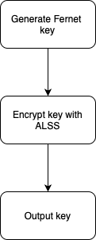
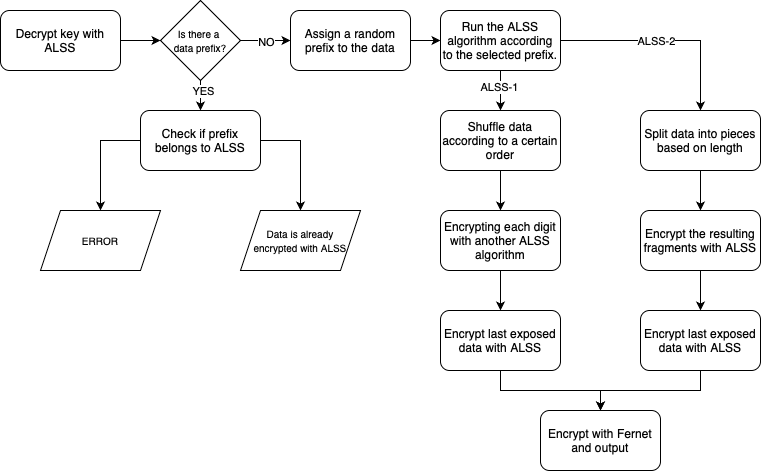
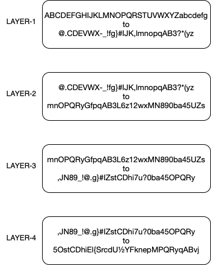

# ALSS

## Description

ALSS is the first cryptography algorithm I developed using Python. Although I am not a cybersecurity expert, I aspire to work in this field. ALSS is a symmetric encryption algorithm that is capable of encrypting and decrypting data multiple times using different methods. Data encrypted with ALSS cannot be decrypted by anyone without the key (including myself). In the future, I plan to share ALSS as an API with 2FA integration, making it accessible to everyone.

## Generate Key

## Main

## ALSS Example

## Watch This

*This is just one example of how ALSS works. The order of these layers varies depending on each prefix.*

## My Plans
I can design a mini USB for 2FA. The key inside the USB can be used when decryption is attempted.
## Help
If there are any weak aspects in the project, please tell me clearly...

